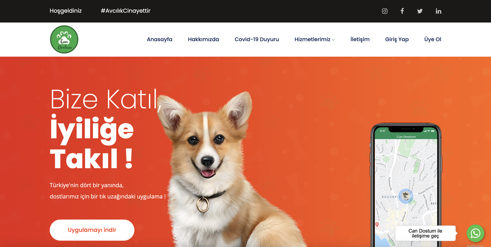

# Can Dostum

Live Preview on Heroku https://can-dostum.herokuapp.com



## Setup

The first thing to do is to clone the repository:

```sh
$ git clone https://github.com/cagatay135/can-dostum.git
$ cd can-dostum
```

Create a virtual environment to install dependencies in and activate it:

```sh
$ virtualenv env
$ source env/bin/activate
```

Then install the dependencies:

```sh
(env)$ pip install -r requirements.txt
```

Once `pip` has finished downloading the dependencies:
```sh
(env)$ cd project
(env)$ python manage.py runserver
```
And navigate to `http://127.0.0.1:8000/`
